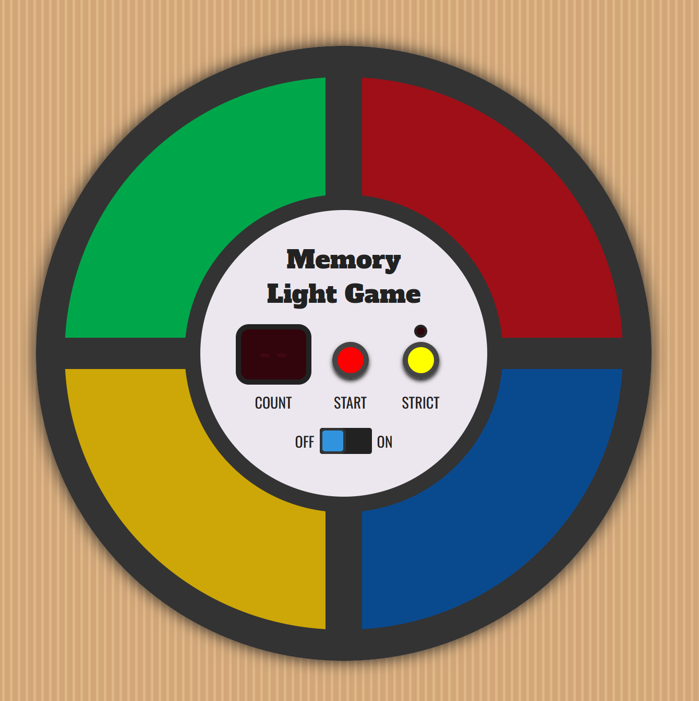
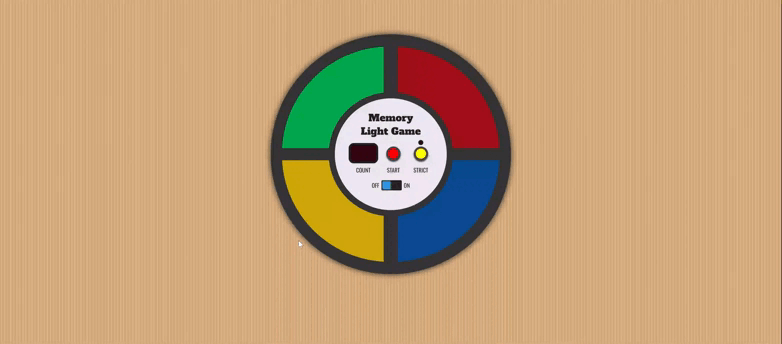

# Memory Light Game

## Website
[Memory Light Game](https://nkachalia1.github.io/Memory-Light-Game/)

## Description

Welcome to **Memory Light Game**, a browser-based interactive memory challenge inspired by the classic Simon game. Players must observe and repeat an increasingly long sequence of colored lights and sounds. The game tests memory, focus, and reaction speed, with a strict mode for added difficulty.

## Instructions

1. **Power On**: Toggle the power switch to ON.
2. **Start Game**: Press the START button to begin.
3. **Watch the Sequence**: The game will flash a sequence of colored lights with corresponding sounds.
4. **Repeat the Sequence**: Click the colored panels in the same order.
5. **Advance Levels**: Each round adds a new step to the sequence.
6. **Strict Mode (Optional)**: Enable STRICT mode to restart the game immediately after a mistake.

## Features

- **Interactive Game Board**: Four colored quadrants that light up and play tones.
- **Progressive Difficulty**: Sequence speed increases as the count grows.
- **Strict Mode**: Mistakes reset the game for an added challenge.
- **Visual Feedback**: LED-style counter displays the current step count.
- **Audio Feedback**: Web Audio API–generated tones for each color and error states.
- **Win Condition**: Successfully complete 20 steps to win the game.

## Usage

### Home Screen

<p align="center">
  
</p>

Displays the game board, counter, control buttons, and power switch.

### Gameplay Preview

<p align="center">
  
</p>

The game highlights each color in sequence. Players must repeat the exact pattern to continue.

### Strict Mode

When enabled, any incorrect input immediately restarts the game from the beginning.

## Technical Details

Memory Light Game is built using:

- **Languages**: JavaScript, HTML, CSS
- **Libraries**: jQuery
- **APIs**: Web Audio API for sound generation
- **Tools**: Git, GitHub, VS Code

---

## Technical Feature Implementation

This section highlights how core gameplay mechanics are implemented under the hood.

### Web Audio API – Sound Generation

Each colored button is associated with a unique oscillator frequency. Oscillators are created once and routed through gain nodes to control volume smoothly.

```js
var frequencies = [329.63, 261.63, 220, 164.81];

var oscillators = frequencies.map(function(frq) {
  var osc = audioCtx.createOscillator();
  osc.type = 'sine';
  osc.frequency.value = frq;
  osc.start(0);
  return osc;
});

var gainNodes = oscillators.map(function(osc) {
  var g = audioCtx.createGain();
  osc.connect(g);
  g.connect(audioCtx.destination);
  g.gain.value = 0;
  return g;
});
```

Smooth audio transitions are achieved using `linearRampToValueAtTime`:

```js
gainNodes[num].gain.linearRampToValueAtTime(vol, audioCtx.currentTime + ramp);
```

An error tone uses a dedicated low-frequency oscillator to clearly signal mistakes.

---

### Game State Management

All game-related state is centralized in a single `gameStatus` object. This avoids global variables and makes resets predictable.

```js
var gameStatus = {
  reset: function() {
    this.init();
    this.strict = false;
  },
  init: function() {
    this.sequence = [];
    this.index = 0;
    this.count = 0;
    this.lock = false;
  }
};
```

Key responsibilities of `gameStatus`:

- Tracking the generated sequence
- Tracking user input progress
- Locking input during playback
- Managing strict vs non-strict behavior

---

### Sequence Generation & Playback

Each round appends a random step (0–3) to the sequence array. The playback speed increases as the count grows.

```js
function addStep() {
  gameStatus.timeStep = setTimeStep(gameStatus.count++);
  gameStatus.sequence.push(Math.floor(Math.random() * 4));
  gameStatus.toHndl = setTimeout(playSequence, 500);
}
```

Playback uses a timed interval to flash lights and play tones in order:

```js
gameStatus.seqHndl = setInterval(function() {
  playGoodTone(gameStatus.sequence[i]);
  gameStatus.toHndl = setTimeout(stopGoodTones, gameStatus.timeStep / 2);
  i++;
}, gameStatus.timeStep);
```

---

### User Input Handling

User interaction is disabled during sequence playback to prevent accidental input. Both mouse and touch events are supported for cross-device compatibility.

```js
$('.push').on('mousedown touchstart', function(e) {
  if (!gameStatus.lock) {
    pushColor($(this));
  }
  e.preventDefault();
});
```

Input is validated step-by-step against the generated sequence. Errors trigger visual and audio feedback.

---

### Error Handling & Strict Mode

When a player makes a mistake:

- A low-frequency error tone plays
- The display flashes `!!`
- In strict mode, the game restarts
- Otherwise, the current sequence replays

```js
if (gameStatus.strict) {
  gameStart();
} else {
  playSequence();
}
```

---

### Win Condition

The game is won after successfully completing 20 steps. A celebratory flashing sequence and sound pattern confirms victory.

```js
else if (gameStatus.index == 20) {
  notifyWin();
}
```

---

## Future Improvements

- Mobile vibration feedback
- Difficulty presets
- High-score tracking
- Accessibility improvements (keyboard-only mode, ARIA labels)

---
